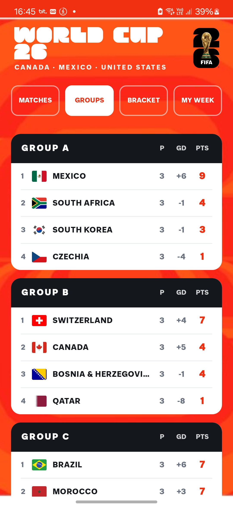
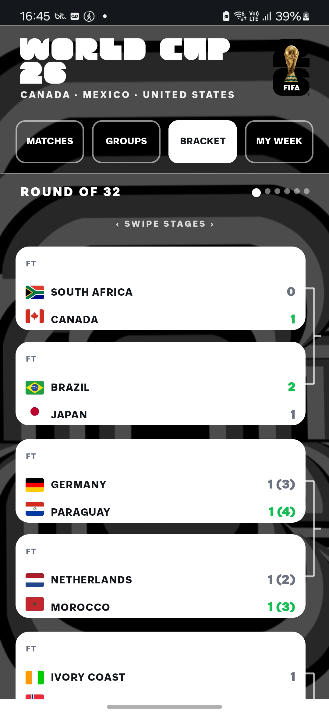
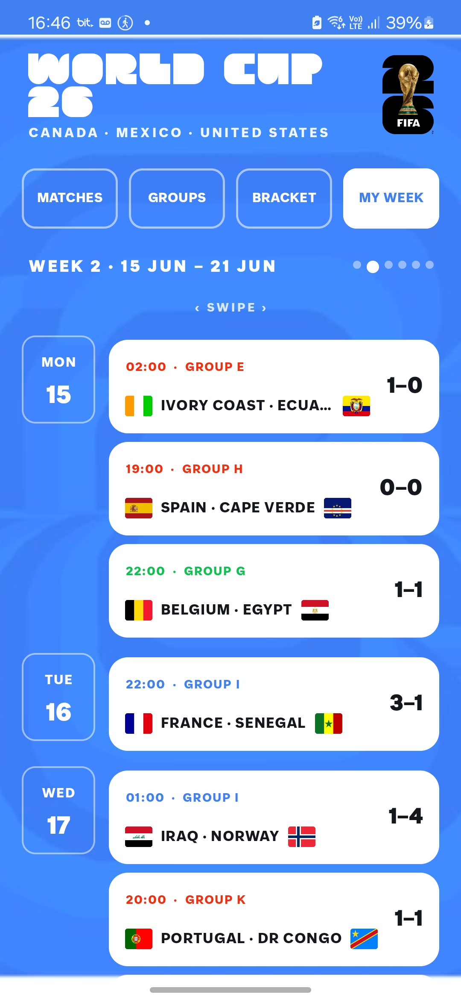
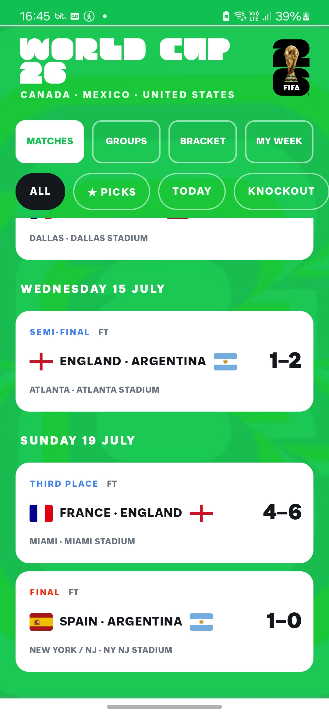
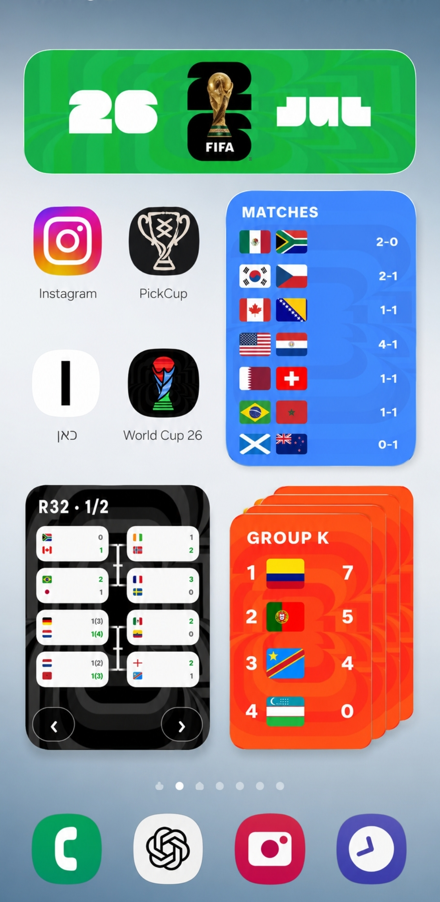
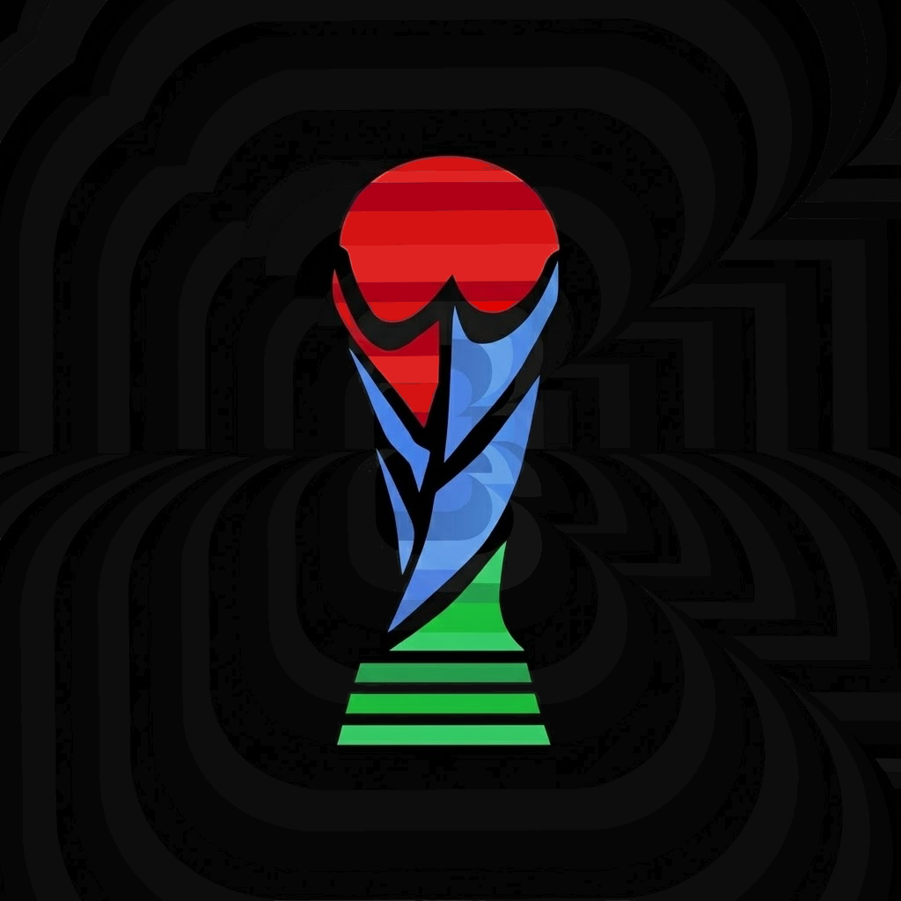

# World Cup 2026 App

The 2026 World Cup branding sparked something in me — so I designed a full app UI from scratch, pages, backgrounds and widgets, and implemented it with AI right before kickoff to follow the football festival the way I wanted to.

**Design and UX by me. Implementation AI-assisted.**

## The design

I built a full visual system, not just screens. Each section has its own colour identity, carried consistently across backgrounds, pills and accents:

- **Matches** — green
- **Groups** — orange
- **Bracket** — monochrome
- **My Week** — blue

Everything ties back to FIFA's official 2026 identity — the trophy mark, the display typography, and the concentric background pattern echoed throughout.

## Screenshots

  
  
  

  
  

  

## Try it

An APK is available under [Releases](../../releases) if you want to run it on an Android device.

## Tech

Design done from scratch by me (backgrounds, layouts, widgets, icon). Implemented into a working Android app with AI assistance, built to ship before the tournament kicked off.
